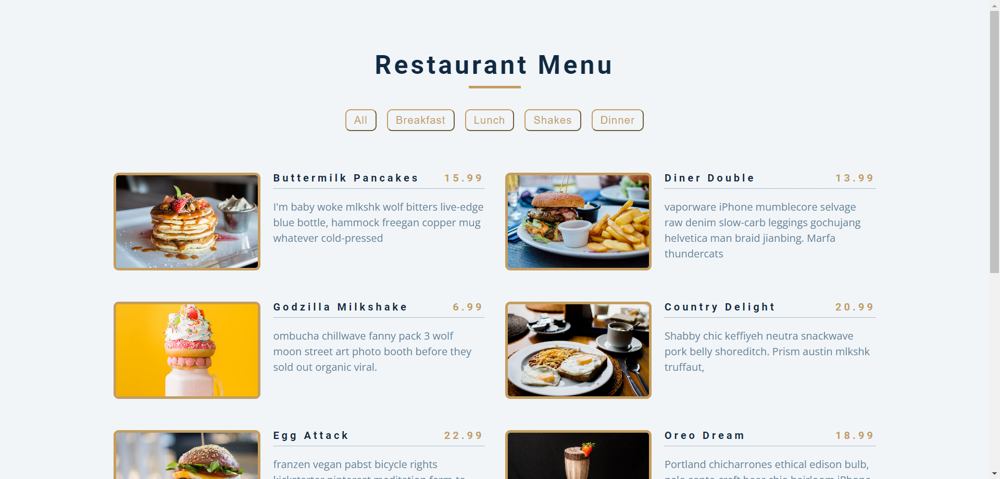

# Restaurant Menu
Hi, this repository contains a Restaurant Menu web application created using HTML, CSS, and JavaScript. The app displays a dynamic menu for a restaurant, allowing users to browse through different categories of food and drinks. This project showcases the use of JavaScript for filtering content, as well as responsive design principles for an optimal user experience on various devices.

Built with:

  

## Output:

